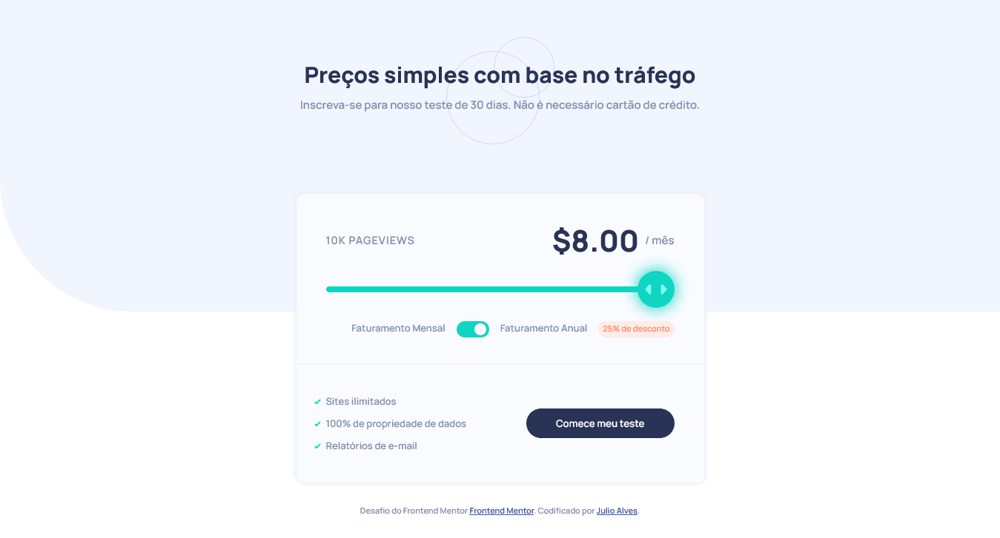

# Frontend Mentor - Componente de preço interativo

Esta é uma solução para o [desafio do componente de preço interativo no Frontend Mentor.](https://www.frontendmentor.io/challenges/interactive-pricing-component-t0m8PIyY8) Os desafios do Frontend Mentor ajudam você a melhorar suas habilidades de codificação ao construir projetos realistas.

Esta é uma solução para o desafio do componente de preço interativo no Frontend Mentor.

## Índice

- [Visão geral](#visão-geral)
  - [O desafio](#o-desafio)
  - [Screenshot](#screenshot)
  - [Links](#links)
- [Processo](#processo)
  - [Construído com](#construído-com)
- [Autor](#autor)

## Visão geral

### O desafio

Os usuários devem ser capazes de:

- Visualizar o layout ideal para o aplicativo, dependendo do tamanho da tela do dispositivo
- Veja os estados de foco para todos os elementos interativos na página
- Use o controle deslizante e alterne para ver preços para diferentes números de visualização de página

### Screenshot

### Links

- URL do site ao vivo: [Link](https://julioalves-dev.github.io/componente-de-preco-interativo/)

## Processo

### Construído com

- HTML5
- CSS3
- JavaScript

## Autor

- Frontend Mentor - [@JulioAlves-Dev](https://www.frontendmentor.io/profile/JulioAlves-Dev)
- Twitter - [@JulioAlv35](https://twitter.com/JulioAlv35)
